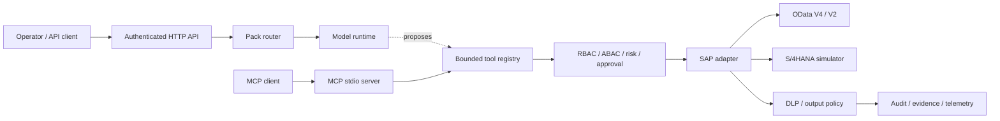

<div align="center">
  
  <h1>CertaOps</h1>
  <p><strong>Policy-governed, read-only procurement intelligence for SAP S/4HANA</strong></p>
  <p>Ask operational questions in natural language while deterministic controls govern every SAP call.</p>
  <p>
    
    
    
    
    
  </p>
</div>

> [!IMPORTANT]
> CertaOps is an independent open-source project. It is not affiliated with, sponsored by,
> certified by, or endorsed by SAP SE.

## Overview

CertaOps is a Python toolkit and operator console for AI-assisted SAP procurement analysis. It
combines an authenticated HTTP API, a provider-neutral model runtime, 21 bounded SAP tools, a
read-only OData adapter, an S/4HANA simulator, and an optional MCP server.

The current release is deliberately **read-only**. Mutating tools are absent from the model,
HTTP API, and MCP catalogs when `SAP_READ_ONLY=true`. The OData client independently rejects
`POST`, `PATCH`, `PUT`, `DELETE`, and `MERGE` before a network request can be sent.

The model may suggest a tool call; it cannot grant itself permissions, widen organizational
scope, disable DLP, lower a risk tier, approve an operation, or suppress the audit trail. Those
decisions remain in deterministic application code.

The model-backed runtime has also completed more than 20 hours of continuous, read-only testing
against the SAP API Business Hub sandbox. Both application write locks remained enabled for the
entire run.

### What it covers

- material search and material context;
- stock, MRP shortages, and supplier comparisons;
- purchase orders, goods receipts, invoices, and document flow;
- supplier delivery, quality, and financial-risk views;
- connection, capability, authorization, audit, and reconciliation diagnostics;
- structured reports generated from SAP-sourced results.

### Safety boundary

| Control | Enforcement |
|---|---|
| Identity | Static-token or OIDC authentication; role and scope checks on every request |
| SAP scope | Tenant, company code, plant, and purchasing-organization ABAC |
| Read-only mode | Catalog filter, policy denial, backend denial, and HTTP-method denial |
| Risk | R0–R4 tool tier plus runtime impact scoring |
| Privacy | Field projection, D0–D3 classification, DLP, masking, and pseudonymization |
| Network | SAP host allowlist, TLS verification, bounded timeout/retry, and circuit breaker |
| Audit | Correlation metadata, evidence handles, and a tamper-evident hash chain |
| Cost/performance | Schema, result, SAP-call, iteration, and concurrency budgets |

## Architecture



The web console uses the authenticated HTTP API. MCP is a separate stdio integration for clients
such as Claude Desktop, VS Code, or Cursor; adding MCP does not bypass the same tool-level policy,
DLP, or audit gates.

## Requirements

- Python 3.10–3.13
- macOS, Linux, or Windows
- an Anthropic or Gemini API key for conversational answers
- optional: an authorized SAP S/4HANA OData endpoint for live reads

The simulator, deterministic tools, tests, and acceptance checks do not require a model key or
SAP tenant.

## Quick start

Clone or download this repository, then run:

```bash
python3 -m venv .venv
source .venv/bin/activate
python -m pip install -e ".[dev]"

python demo.py
python scripts/verify.py
pytest -q
```

On Windows PowerShell, activate the environment with:

```powershell
.venv\Scripts\Activate.ps1
```

Explore the deterministic tool layer:

```bash
python demo.py --list
python demo.py --tokens
python demo.py --tool sap_material_360 --args '{"material_id":"SFT-SCN-270"}'
```

## Configure a model provider

Copy the example configuration. Real values belong only in `.env`; never place them in an
example file, command committed to shell history, or source code.

```bash
cp .env.example .env
chmod 600 .env
```

Anthropic:

```ini
MODEL_PROVIDER=anthropic
MODEL_NAME=claude-sonnet-5
ANTHROPIC_API_KEY=<your-anthropic-key>
```

```bash
python -m pip install -e ".[anthropic]"
```

Gemini Developer API:

```ini
MODEL_PROVIDER=gemini
MODEL_NAME=gemini-3.7-flash
GEMINI_BACKEND=developer
GEMINI_API_KEY=<your-gemini-key>
GEMINI_STORE_INTERACTIONS=false
```

Gemini on Vertex AI:

```ini
MODEL_PROVIDER=gemini
MODEL_NAME=gemini-3.7-flash
GEMINI_BACKEND=vertex
GOOGLE_CLOUD_PROJECT=<project-id>
GOOGLE_CLOUD_LOCATION=europe-west4
```

`MODEL_PROVIDER` is authoritative. If keys for more than one provider exist, the launcher uses the
explicit provider and validates that provider's own credential.

## Start the operator console

On macOS, double-click `baslat.command` or run it in Terminal. The menu asks for the data source
and role, then opens the console in the browser.

```bash
./baslat.command
```

Non-interactive examples:

```bash
./baslat.command --sim --rol denetci
./baslat.command --sap --rol satinalmaci
PORT=8123 ./baslat.command --sap --rol denetci
./baslat.command --help
```

| Role | Intended use |
|---|---|
| `denetci` | Health, logs, audit, and read-only operational review |
| `satinalmaci` | Procurement analysis and no-write request drafts |
| `onaylayici` | Approval-flow visibility for future-write regression work |

The launcher creates local role tokens once in `.env.local`, stores only their hashes in
`config/principals.json`, keeps both SAP write locks enabled, copies the selected token to the
clipboard, and binds the service to `127.0.0.1`.

For a platform-neutral start:

```bash
python run_api.py
```

Then open `http://127.0.0.1:8000/ui`. API documentation is available at
`http://127.0.0.1:8000/docs`.

## Connect to live SAP

Keep both read-only locks enabled:

```ini
SAP_BACKEND=odata
SAP_SYSTEM_ALIAS=S4Q
SAP_BASE_URL=https://s4hana.example
SAP_ALLOWED_HOSTS=s4hana.example
SAP_AUTH_MODE=oauth2
SAP_OAUTH_TOKEN_URL=https://identity.example/oauth/token
SAP_OAUTH_CLIENT_ID=<client-id>
SAP_OAUTH_CLIENT_SECRET=<client-secret>
SAP_CLIENT=100
SAP_COMPANY_CODE=1000
SAP_PLANT=1100
SAP_PURCH_ORG=1000
SAP_READ_ONLY=true
SAP_DRY_RUN=true
```

Supported connection paths include OAuth 2.0 client credentials, SAP BTP Destination, the SAP API
Business Hub sandbox, and development-only Basic authentication. Production profiles fail closed
when TLS verification, authentication, state encryption, host restrictions, or read-only controls
are unsafe.

Run live integration tests only against an authorized quality tenant:

```bash
SAP_INTEGRATION_TESTS=1 \
SAP_INTEGRATION_MATERIAL=<material-id> \
pytest tests/integration -v
```

> [!CAUTION]
> `--sap` performs real reads against the endpoint configured in `.env`. It does not enable SAP
> writes. Validate service paths, custom fields, authorization roles, and business semantics in a
> quality tenant before production use.

## Data sent to the model provider

Conversational mode sends the user's prompt and the minimum tool context needed for synthesis to
the configured model provider. Tool results pass through field policy and DLP before model egress;
D3 fields are masked, dropped, denied, or tenant-scoped pseudonyms are substituted according to
the active sink policy.

This is a technical control, not a substitute for a data-processing agreement. Before using live
SAP data, confirm the selected provider, region, retention settings, account terms, and your
organization's privacy policy. Use the simulator when external model egress is not approved.

## HTTP API

| Endpoint | Purpose |
|---|---|
| `GET /health` | Runtime, model, SAP backend, retention, and safety posture |
| `POST /chat` | One governed conversational turn |
| `GET /tools` | Actor-visible tool and risk contracts |
| `GET /agents` | Domain/profile catalog |
| `GET /telemetry` | Token, cache, policy, privacy, and SAP-call metrics |
| `GET /sessions` | List actor-owned sessions |
| `DELETE /sessions/{id}` | Delete an actor-owned session |
| `GET /audit/recent` | Tenant-filtered audit records; requires `audit.read` |
| `GET /logs` | Masked in-memory logs; requires `audit.read` |
| `GET /ui/mcp` | Secret-free MCP status and client template |
| `POST /ui/mcp/test` | Read-only MCP initialize/tools-list diagnostic |

The operator UI is vanilla HTML, CSS, and JavaScript served from the same origin. It uses no CDN,
analytics, third-party font, or build-time Node dependency. A strict Content Security Policy is
applied, model/SAP output is rendered as text, and the bearer token is held in `sessionStorage`.

## MCP server

Install the optional MCP dependency and inspect the read-only catalog:

```bash
python -m pip install -e ".[mcp]"
certaops-mcp --list
certaops-mcp
```

Minimal client configuration:

```json
{
  "mcpServers": {
    "certaops": {
      "command": "/absolute/path/to/certaops/.venv/bin/certaops-mcp",
      "cwd": "/absolute/path/to/certaops",
      "env": {
        "SAP_BACKEND": "mock",
        "SAP_READ_ONLY": "true",
        "SAP_DRY_RUN": "true",
        "CERTAOPS_MCP_ALLOW_WRITE": "0"
      }
    }
  }
}
```

The stdio server has a process-scoped actor rather than per-request authentication. Use the HTTP
API for multi-user deployments. Do not copy SAP credentials into committed MCP configuration;
inject them from a local environment or managed secret store.

## Tool catalog

The registry contains 21 tools; 20 are visible in the default read-only product catalog. The
dormant `sap_pr_submit` implementation exists only for isolated future-write regression tests and
is denied by the current release boundary.

Representative tools:

| Domain | Tools |
|---|---|
| Platform | `sap_connection_health`, `sap_discover_capabilities`, `sap_get_execution_audit` |
| Master data | `sap_search_materials`, `sap_material_360` |
| Planning | `sap_stock_overview`, `sap_mrp_shortage_explain` |
| Procurement | `sap_compare_vendors`, `sap_supplier_score_360`, `sap_track_purchase_orders` |
| Procure-to-pay | `sap_document_flow`, `sap_purchase_order_360`, `sap_supplier_invoice_status`, `sap_invoice_block_explain` |
| Reporting | `sap_generate_report` |

Document relationships are never inferred. Each edge must carry an SAP reference field such as
`EKPO-BANFN`, `MSEG-EBELN`, or `RSEG-EBELN`.

## Security and repository hygiene

- `.env`, `.env.local`, `.env.real-sap`, `.env.yedek-*`, private keys, local principals, SQLite
  state, logs, generated reports, archives, and build outputs are ignored by Git.
- Only sanitized `.env.*.example` templates are intended for version control.
- The CI workflow uses read-only permissions, runs Gitleaks across full history, audits Python
  dependencies, creates an SBOM, and executes policy/privacy/concurrency/performance gates.
- Production credentials should come from a managed secret store; plaintext `.env` files are a
  local-development convenience and must remain owner-readable only.
- If a credential is ever committed, removing the file is insufficient: revoke/rotate the value
  first, then rewrite repository history before publishing.

Pre-push checks:

```bash
ruff check .
pytest -q
python scripts/verify.py
python demo.py --tokens
python scripts/perf_benchmark.py
pip-audit --progress-spinner off --skip-editable
bandit -r src baslat.py run_api.py run_cli.py demo.py -q -ll
git diff --check
```

## Verification status

Verified locally on 2 September 2026:

| Gate | Result |
|---|---|
| Full suite | 969 passed, 14 skipped, 1 expected xfail |
| Acceptance checks | 28/28 passed |
| Ruff | Passed |
| Dependency audit | No known vulnerabilities |
| Bandit | No high- or medium-severity findings |
| Schema budgets | 5/5 domain profiles within budget |
| Simulator performance | 9/9 scenarios within latency, SAP-call, and result budgets |
| SAP API Business Hub soak | 20+ hours, read-only; both write locks enabled |

The skipped tests require an explicitly authorized SAP integration tenant. Simulator latency does
not predict WAN, SAP workload, authorization, or custom-service latency in a live environment.
The API Business Hub sandbox run validates the public API surface and long-running read path; it
does not prove customer-tenant semantics or production capacity.

## Project status

CertaOps is an alpha release intended for architecture evaluation, simulator-backed development,
and controlled quality-tenant pilots. It is not a certified SAP product or production support
offering. Production deployments still require organization-specific threat modeling, managed
identity and secrets, external highly available state, immutable audit export, monitoring, backup,
and incident-response procedures.

## Contributing

Changes must preserve the core invariant: identity, authorization, organizational scope, risk,
approval, DLP, and audit decisions stay in deterministic code rather than prompts. Include focused
tests for every behavior change and run the pre-push checks before opening a pull request.

## License and trademarks

Released under the [MIT License](LICENSE).

SAP and SAP S/4HANA are trademarks or registered trademarks of SAP SE or its affiliates in Germany
and other countries. Their use here describes interoperability only. No SAP logo or proprietary
artwork is included.
