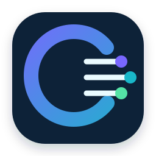
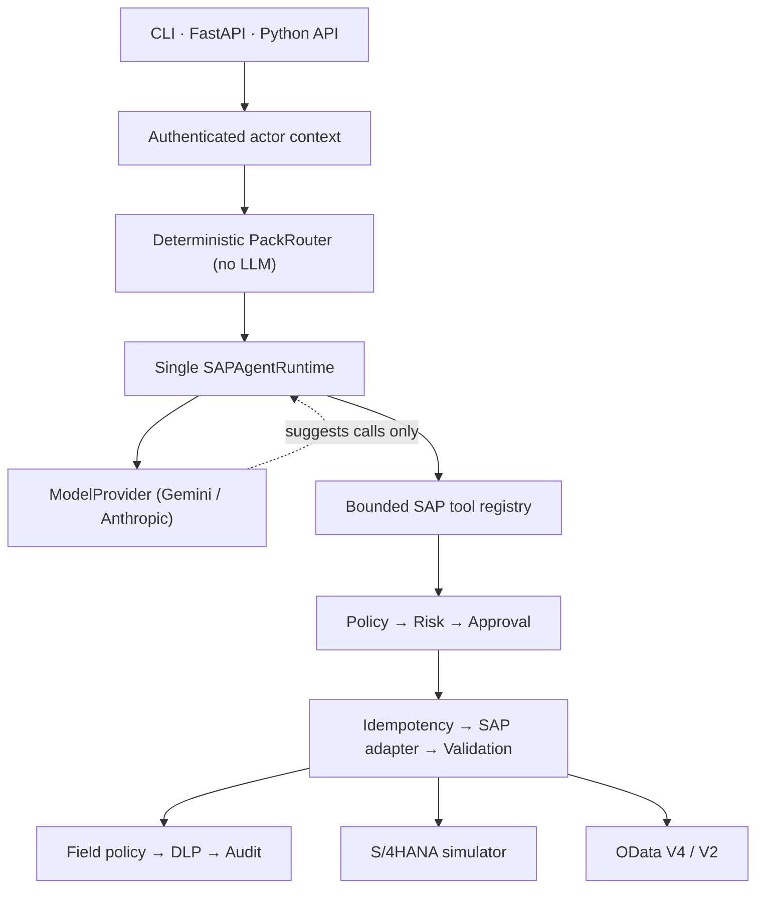

<div align="center">
  
  <h1>CertaOps</h1>
  <p><strong>Policy-governed AI agent toolkit for SAP S/4HANA®</strong></p>
  <p>Build auditable SAP operations agents with bounded tools, deterministic controls, and human approval.</p>
  <p>
    
    
    
    
    
    
  </p>
</div>

> [!IMPORTANT]
> CertaOps is an independent open-source project. It is not affiliated with, sponsored by,
> certified by, or endorsed by SAP SE.

## What is CertaOps?

CertaOps is a Python toolkit for building AI-assisted operations exclusively around SAP
S/4HANA. It combines five domain-isolated agents with 24 purpose-built SAP tools and a
deterministic security runtime.

The language model can propose a tool call; it cannot grant itself access, approve a write,
lower a risk score, bypass tenant boundaries, or suppress the audit trail. Those decisions are
enforced in code before and after every SAP call.

CertaOps focuses on SAP master data, planning, procurement, procure-to-pay visibility, project
finance, and operational diagnostics. It does **not** provide robotics engineering, generic BOM
design, safety calculations, or general-purpose document automation.

## Why it exists

Giving an AI model an SAP credential is easy. Making every action bounded, explainable, and
recoverable is the hard part.

| Capability | What CertaOps enforces |
|---|---|
| Identity and scope | Actor, tenant, company code, plant, purchasing organization, and role checks |
| Runtime risk | R0–R4 operation tier plus a verified 0–100 impact score |
| Human approval | Stored approval evidence, separation of duties, expiry, and replay protection |
| Safe writes | Prepare/submit split, idempotency lease, read-after-write, and reconciliation |
| Data privacy | D0–D3 classification, field-level projection, DLP, masking, and pseudonymization |
| Auditability | Evidence handles, structured telemetry, and a tamper-evident hash chain |
| Cost control | Per-agent schema budgets, result budgets, SAP-call budgets, and bounded concurrency |

## Architecture



**One user turn = one model loop.** Domains are no longer separate agent objects; they are
metadata — a system prompt fragment, a tool pack, an iteration budget, and an access scope
(`certaops.runtime.profiles`). A multi-domain request computes the union of authorized packs
and runs a single loop instead of N sequential LLM calls.

The model **never executes a tool**. It only proposes function calls; every call goes through
`execute_tool` and therefore through RBAC/ABAC, dynamic risk scoring, human approval,
idempotency, DLP, audit, timeouts, and result budgets. Tool names the model invents, or tools
outside the actor's authorized set, are rejected fail-closed.

## Agent and tool catalog

| Agent | Responsibility | Representative tools |
|---|---|---|
| Platform & Diagnostics | Capability discovery, connection health, authorization errors, audit, reconciliation | `sap_discover_capabilities`, `sap_connection_health`, `sap_get_execution_audit` |
| Master Data | Material discovery, product context, classification, valuation | `sap_search_materials`, `sap_material_360` |
| Planning & Supply Chain | Stock, ATP, MRP shortages, vendor comparison, open orders | `sap_stock_overview`, `sap_atp_check`, `sap_mrp_shortage_explain` |
| Procurement | Purchase requisition preparation and controlled submission | `sap_pr_prepare`, `sap_pr_submit` |
| Project Finance & Reporting | WBS cost status and SAP-sourced reports | `sap_project_cost_status`, `sap_generate_report` |

Procure-to-pay visibility adds five read-only tools:

- `sap_document_flow`
- `sap_purchase_order_360`
- `sap_workflow_status`
- `sap_supplier_invoice_status`
- `sap_invoice_block_explain`

Document links are never inferred. Every relationship must carry the SAP reference field that
proves it, such as `EKPO-BANFN`, `MSEG-EBELN`, or `RSEG-EBELN`.

## Quick start

The simulator and deterministic tool layer do not require an API key or SAP tenant.

```bash
git clone https://github.com/alimkacar/certaops-agent-toolkit.git
cd certaops-agent-toolkit

python3 -m venv .venv
source .venv/bin/activate
python -m pip install -e ".[dev]"

python demo.py
python scripts/verify.py
pytest -q
```

Explore individual tools:

```bash
python demo.py --list
python demo.py --tokens
python demo.py --tool sap_material_360 --args '{"material_id":"SFT-SCN-270"}'
```

## Run the AI agent

The runtime is provider-agnostic: core code depends on no vendor SDK type. The default
provider is Google Gemini.

### Gemini Developer API (development / quality)

```bash
cp .env.example .env
```

```bash
MODEL_PROVIDER=gemini
MODEL_NAME=gemini-3.7-flash
GEMINI_API_KEY=<your key>
GEMINI_BACKEND=developer
GEMINI_THINKING_LEVEL=low
GEMINI_STORE_INTERACTIONS=false
```

### Vertex AI (recommended for production SAP data)

```bash
MODEL_PROVIDER=gemini
MODEL_NAME=gemini-3.7-flash
GEMINI_BACKEND=vertex
GOOGLE_CLOUD_PROJECT=<project>
GOOGLE_CLOUD_LOCATION=europe-west4
```

Vertex is the recommended production backend for SAP data because it runs under a Google Cloud
enterprise data-processing agreement. The production profile emits a blocker for
`GEMINI_BACKEND=developer`.

### Anthropic (optional)

```bash
pip install ".[anthropic]"
```

```bash
MODEL_PROVIDER=anthropic
MODEL_NAME=claude-sonnet-5
ANTHROPIC_API_KEY=<your key>
```

`ANTHROPIC_API_KEY` is no longer required to start the service.

```bash
python run_cli.py
python run_cli.py -p "Show ATP and MRP status for HD-GEAR-CSF25-100"
```

### Gemini 3 notes

- `temperature`, `top_p`, `top_k` and `candidate_count` were removed in Gemini 3. The adapter
  does not send them. Reasoning budget is set with `thinking_level`
  (`low` → simple single-tool reads, `medium` → multi-step or multi-domain, `high` → only with
  `GEMINI_ALLOW_HIGH_THINKING=true`).
- The SDK's **automatic function calling is always disabled**. Only pure JSON schemas are sent;
  no callable is ever handed to the SDK. This keeps every SAP call behind the security gate.
- Gemini 3 thought signatures are carried opaquely and are never logged, audited, shared across
  tenants, or turned into conversation text.

After installation, the CLI is also available as:

```bash
certaops
```

Python API:

```python
from certaops import SAPMultiAgent

agent = SAPMultiAgent()
turn = agent.chat("Show cost and commitment status for WBS R-2026-014")

print(turn.active_agents)
print(turn.text)
```

## Run the API

```bash
python run_api.py
# or
uvicorn certaops.api:app --host 127.0.0.1 --port 8000
```

Open `http://127.0.0.1:8000/docs` for the generated OpenAPI interface.

| Endpoint | Purpose |
|---|---|
| `GET /health` | Runtime, SAP backend, audit, and safety posture |
| `GET /agents` | Domain-agent catalog and handoff contract |
| `GET /tools` | Actor-visible tool and risk contracts |
| `POST /chat` | Orchestrated agent turn with trace metadata |
| `POST /approvals` | Local pilot approval endpoint; use an external workflow in production |
| `GET /telemetry` | Token, policy, privacy, cache, and SAP-call metrics |
| `GET /sessions` | List actor-owned sessions |
| `DELETE /sessions/{id}` | Delete an actor-owned session |

## Connect to SAP S/4HANA

Keep `SAP_DRY_RUN=true` until your own quality-tenant validation is complete.

```ini
SAP_BACKEND=odata
SAP_SYSTEM_ALIAS=S4Q
SAP_BASE_URL=https://s4hana.example
SAP_AUTH_MODE=oauth2
SAP_ALLOWED_HOSTS=s4hana.example
SAP_CLIENT=100
SAP_COMPANY_CODE=1000
SAP_PLANT=1100
SAP_PURCH_ORG=1000
SAP_DRY_RUN=true
```

Supported authentication paths include OAuth 2.0 client credentials and SAP BTP Destination.
Basic authentication is restricted to development profiles. The adapter prefers released OData
V4 services and falls back to V2 where configured; it includes pagination, CSRF handling, ETags,
host allowlisting, timeouts, and bounded retries.

Run live integration tests only against an authorized quality tenant:

```bash
SAP_INTEGRATION_TESTS=1 \
SAP_BACKEND=odata \
SAP_INTEGRATION_MATERIAL=<material-id> \
pytest tests/integration -v
```

Write-path integration tests additionally require `SAP_INTEGRATION_ALLOW_WRITE=1` and
`SAP_DRY_RUN=false`.

## Safe write protocol

`sap_pr_submit` cannot write directly from an unverified model request. The runtime:

1. Resolves the actor, tenant, and organizational scope.
2. Reprices and validates the prepared request with current SAP data.
3. Produces an item diff and canonical payload hash.
4. Verifies stored approval evidence and separation of duties.
5. Acquires the idempotency lease and reserves the approval atomically.
6. Executes one SAP write.
7. Reads the document back and checks postconditions.
8. Appends the result to the audit chain.
9. Reconciles ambiguous timeouts instead of blindly retrying `POST`.

Production mode fails closed for unsafe combinations such as a mock backend, disabled
authentication, in-memory state, unencrypted evidence, local write approval, or an unrestricted
outbound SAP host.

## Verification status

| Layer | Current evidence |
|---|---|
| Full suite | 705 passing, 15 skipped (720 collected) |
| Local security and policy runtime | `tests/policy` + `security` + `privacy` + `concurrency`: all passing |
| Acceptance behavior | 28/28 executable checks with evidence output |
| SAP tool behavior | End-to-end against the bundled S/4HANA simulator |
| OData V2/V4 adapter | Contract-tested against recorded `$metadata` fixtures |
| Live tenant semantics | 15 integration tests included, skipped without an authorized tenant |

Run the same quality gates used by CI:

```bash
ruff check .
pytest -q --cov --cov-report=term-missing
pytest tests/policy tests/security tests/privacy tests/concurrency -q
pytest tests/performance tests/e2e tests/contract -q
python scripts/verify.py
python demo.py --tokens
python scripts/perf_benchmark.py
```

> [!CAUTION]
> Simulator results and recorded metadata contracts do not prove compatibility with your SAP
> release, custom fields, authorization model, tolerances, or business processes. Validate every
> read and write path in a quality tenant before production use.

## Configuration

`.env.example` documents the complete configuration surface, including:

- model provider (`MODEL_PROVIDER`, `MODEL_NAME`), Gemini Developer/Vertex backends,
  `thinking_level`, and provider-side storage controls;
- iteration and token budgets;
- mock or OData SAP backends;
- OAuth 2.0, BTP Destination, and development-only Basic auth;
- static-token or OIDC API authentication;
- approval, risk, DLP, retention, evidence, cache, and session controls;
- production fail-closed requirements.

Never commit `.env`, credentials, private keys, live principal catalogs, generated reports, or
runtime state. The repository ignore rules cover the default locations.

## Health and observability

`GET /health` reports the provider, model, and backend — never the API key:

```json
{
  "model": {
    "provider": "gemini",
    "model": "gemini-3.7-flash",
    "backend": "vertex",
    "configured": true,
    "thinking_level": "low",
    "store_interactions": false
  },
  "direct_answers": { "enabled": true, "tools": ["sap_stock_overview", "..."] }
}
```

Provider and model are also written to every audit record, so a behaviour change can be traced
back to the model version that produced it.

## Migration from the multi-agent architecture

Version 0.2.0 replaced five sequential domain agents with one runtime. See
[`docs/MIGRATION.md`](docs/MIGRATION.md). `SAPMultiAgent` and `SAPDomainAgent` still work as
deprecated facades over `certaops.runtime.SAPAgentRuntime`.

## Project status

CertaOps is an early open-source release intended for architecture evaluation, simulator-backed
development, and controlled quality-tenant pilots. It is not a certified SAP product and is not
offered as production-ready integration software.

Known deployment work includes live-tenant semantic validation, an external highly available
state backend, managed key integration, immutable external audit checkpoints, centralized
telemetry export, and a curated adversarial agent-evaluation suite.

## Contributing

Contributions should preserve the core invariant: policy, authorization, risk, approval, and data
access decisions stay in deterministic code rather than prompts. Please open an issue before a
large architectural change and include focused tests with every behavior change.

## License and trademarks

Released under the [MIT License](LICENSE). See [CHANGELOG.md](CHANGELOG.md) for release notes.

SAP and SAP S/4HANA are trademarks or registered trademarks of SAP SE or its affiliates in
Germany and other countries. CertaOps is independent of SAP SE; use of the names only describes
software compatibility. No SAP logo or proprietary artwork is included.
